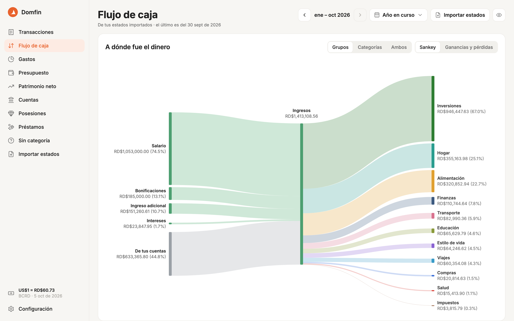
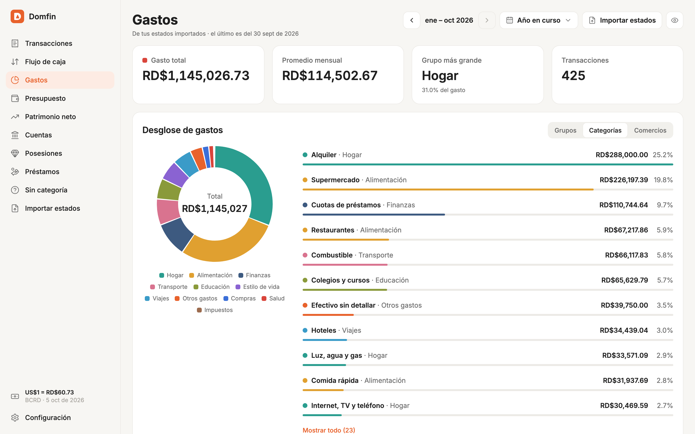
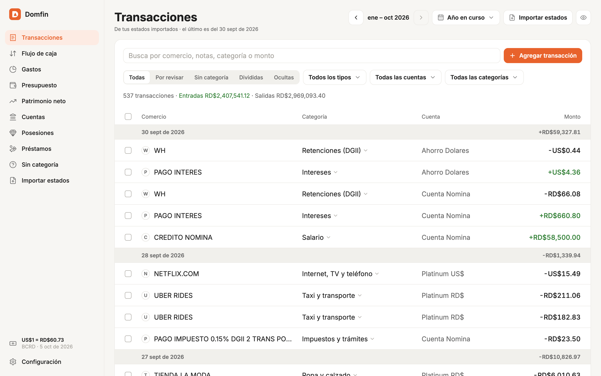
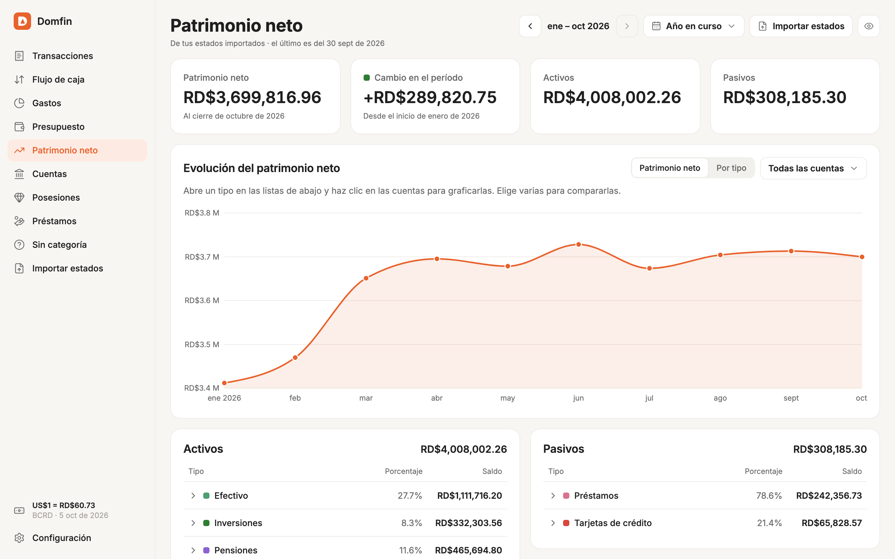
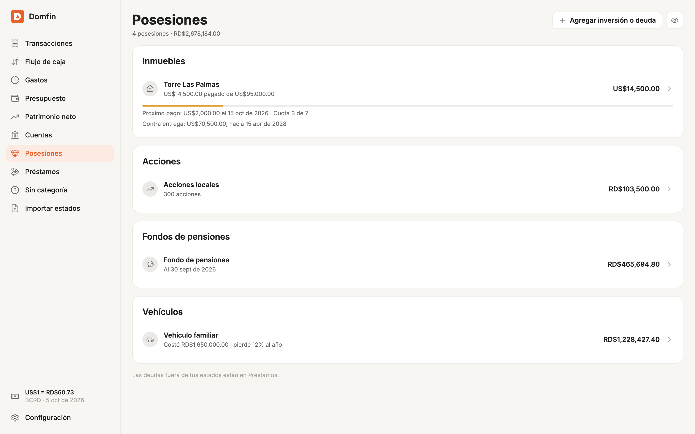
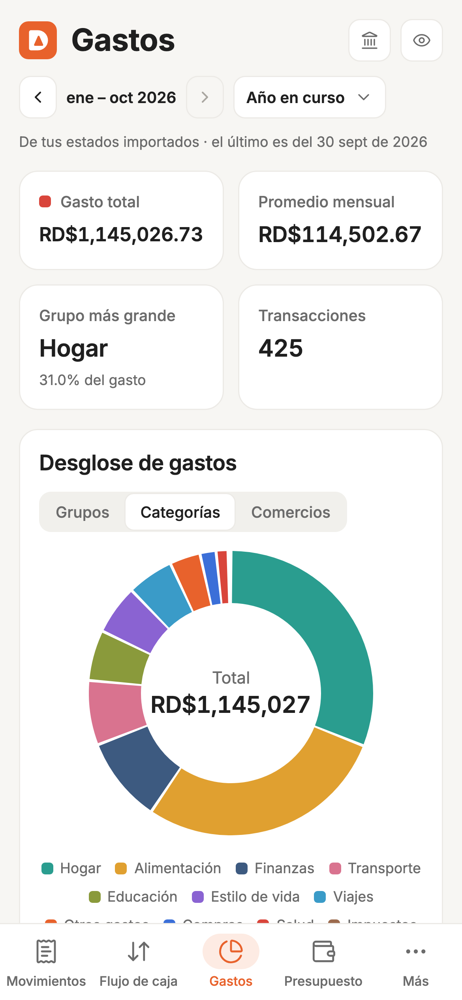
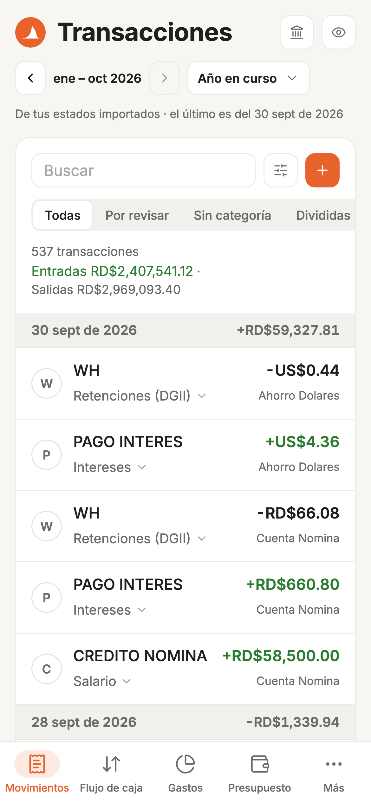
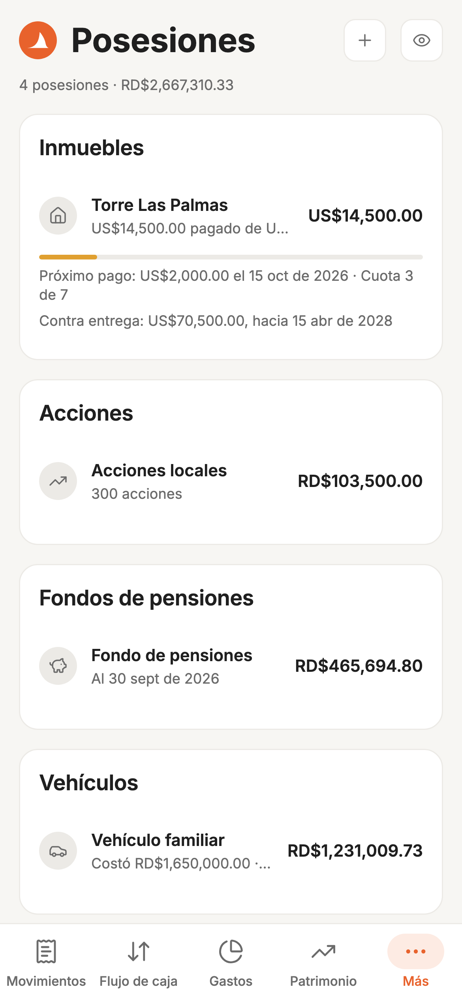

<p align="center">
  
</p>

<h1 align="center">Domfin</h1>

<p align="center">
  Tus finanzas personales en República Dominicana, armadas con los estados de
  cuenta de tu banco: en pesos y en dólares, y sin que tu información salga de
  tu computadora.
</p>

<p align="center">
  <a href="#cómo-montarlo">Cómo montarlo</a> ·
  <a href="#con-datos-de-ejemplo">Pruébalo con datos de ejemplo</a> ·
  <a href="#hoja-de-ruta">Hoja de ruta</a> ·
  <a href="CONTRIBUTING.md">Cómo contribuir</a>
</p>



Domfin lee los PDF que te da tu banco, clasifica cada movimiento y te muestra
a dónde se fue tu dinero, cuánto tienes y cuánto debes.

<sub>Todas las capturas usan datos inventados, los mismos que puedes cargar
para [probar Domfin](#con-datos-de-ejemplo) sin tus estados.</sub>

## Qué hace

- **Flujo de caja**: lo que entró y a dónde se fue, en un diagrama de Sankey
  (ingresos, gastos por grupo, inversiones, lo que quedó en tus cuentas y lo
  que cubriste con préstamos), y una tabla con el porcentaje de tus
  ingresos.
- **Gastos**: por grupo, por categoría y por comercio, mes a mes.
- **Presupuesto**: tus gastos fijos (alquiler, servicios, cuotas,
  suscripciones), que Domfin encuentra porque se repiten mes tras mes en tus
  estados, cuáles ya pagaste este mes y cuánto te queda para lo demás.
- **Transacciones**: cada movimiento clasificado solo (por el código del
  comercio, la descripción del banco, tu nómina y tus reglas). Lo que falte
  lo cambias desde la fila, y Domfin te ofrece crear la regla para la
  próxima vez.
- **Patrimonio neto**, **Cuentas** y **Préstamos**: tus saldos de fin de mes,
  con su historia.
- **Posesiones**: lo que tienes y ningún estado muestra, como un apartamento
  comprado en plano (con su plan de pagos), acciones, tu fondo de pensiones
  (AFP) o tu vehículo. También las deudas fuera del banco.
- **Pesos y dólares**: cada movimiento se convierte con la tasa del Banco
  Central del día en que ocurrió.
- **Montos ocultos**: el ojito de arriba los cambia por `RD$x,xxx.xx` cuando
  alguien más puede ver tu pantalla.
- **Importar**: eliges uno o varios PDF; en iOS y Android también puedes
  compartirlos con Domfin desde otra app (el correo, Archivos o WhatsApp), y
  se importan solos.
- **Respaldos cifrados**: una copia de tus datos en la carpeta de tu nube
  (iCloud Drive, Google Drive, Dropbox u OneDrive) cada día y después de cada
  importación, que solo abren tu contraseña o tu clave de recuperación.
- En español y en inglés, en la web, iOS y Android.

## Cómo se ve

<table>
  <tr>
    <td width="50%" valign="top">
      
      <p align="center"><b>Gastos</b> por grupo, categoría y comercio</p>
    </td>
    <td width="50%" valign="top">
      
      <p align="center"><b>Transacciones</b> clasificadas solas</p>
    </td>
  </tr>
  <tr>
    <td width="50%" valign="top">
      
      <p align="center"><b>Patrimonio neto</b> mes a mes</p>
    </td>
    <td width="50%" valign="top">
      
      <p align="center"><b>Posesiones</b> que ningún estado muestra</p>
    </td>
  </tr>
</table>

<p align="center">
  
  &nbsp;
  
  &nbsp;
  
</p>

## Qué bancos lee

| Banco | Documentos |
| --- | --- |
| Banco Popular | Estados de tarjeta de crédito, estados de cuentas de ahorro y corrientes (escaneados o impresos), historiales de préstamo (incluido el Extracrédito) y de certificado financiero. |
| Qik | Estados de tarjeta de crédito. |

¿Tu banco no está? Mira [cómo agregar uno](CONTRIBUTING.md#agregar-un-banco).

## Tu información no sale de tu computadora

- Domfin son dos programas que corren en tu computadora: domfin-api
  ([`api/`](api)), que lee y guarda tus estados, y la app ([`app/`](app)).
  No hay cuentas que crear, ni servidor en la nube, ni conexión con tu
  banco: tú le das los PDF.
- domfin-api solo le da tus datos a esta misma computadora, nunca a otros
  equipos de tu red.
- La contraseña de tus PDF se guarda en la base local, que solo tu usuario
  puede leer. Domfin nunca la muestra.
- Tus respaldos salen de tu computadora ya cifrados: el servicio de tu nube
  solo guarda algo ilegible, y Domfin nunca habla con él.
- Domfin solo se conecta a Internet para buscar la tasa del dólar del Banco
  Central (una vez al día) y para ver si hay una versión nueva en GitHub
  (como mucho dos veces al día; se puede apagar). Ninguna de las dos lleva
  datos tuyos. Instalarlo sí descarga Go, Node.js y las dependencias desde
  sus sitios oficiales, y al arrancar con `./domfin start`, Expo (con lo que
  corre la app) no manda nada.

## Cómo montarlo

Solo necesitas macOS, Linux o Windows, y [Git](https://git-scm.com/downloads).
Lo demás lo instala Domfin.

### 1. Descarga Domfin

```bash
git clone https://github.com/powky/domfin.git
cd domfin
```

### 2. Prepáralo

```bash
./domfin setup
```

En Windows, desde PowerShell o el símbolo del sistema: `.\domfin.cmd setup`.

Revisa lo que Domfin necesita, salta lo que ya tienes e instala lo que falte:

- **Go y Node.js**, si no los tienes o son muy viejos. Los baja de sus sitios
  oficiales, verifica cada descarga y los deja en `.tools/`, dentro de la
  carpeta de Domfin: no se instalan en tu sistema.
- **Los módulos de domfin-api**, que compila (la primera vez tarda unos
  minutos), y **las dependencias de la app**.

Al final te dice qué ya tenías y qué instaló. Puedes correrlo las veces que
quieras.

### 3. Arráncalo

```bash
./domfin start
```

En Windows: `.\domfin.cmd start`.

Arranca domfin-api y la app juntas, y abre la app en tu navegador. Para
apagar las dos, presiona Ctrl+C en esa terminal. Si te falta algo, `start`
corre `setup` antes: con este comando basta.

#### Los puertos

domfin-api usa el 8080 y la app el 8081
([http://localhost:8081](http://localhost:8081)), pero no hace falta que
estén libres:

- Si otro programa tiene uno, `start` usa el siguiente libre y te dice cuál:
  «El puerto 8081 está ocupado: la app usa el 8082».
- Si en el 8080 ya hay una domfin-api corriendo, la usa en vez de arrancar
  otra.
- Al apagar Domfin, con Ctrl+C o cerrando la terminal, se apaga lo que
  `start` arrancó y sus puertos quedan libres. Una domfin-api que ya estaba
  corriendo antes sigue corriendo.
- Para usar puertos fijos: `./domfin start --api-port 8085 --app-port 8086`.
  Si alguno está ocupado, te lo dice en vez de cambiarlo.
- El navegador guarda por puerto tu idioma, tu moneda, la apariencia y si
  ocultas los montos: si la app arranca en otro puerto, empieza con los de
  siempre. Si el 8081 siempre está ocupado, cae siempre en el mismo puerto
  libre y los recuerda.

#### Con datos de ejemplo

Para ver Domfin antes de darle tus estados:

```bash
./domfin start --demo
```

Arranca con una base aparte, llena de datos inventados (los de las
capturas): una cuenta de nómina, una en dólares, dos tarjetas, un préstamo,
un certificado y algunas posesiones, desde enero del año pasado. Usa sus
propios puertos, el 8090 y el 8091, así que puede correr junto a tu Domfin.
Tu base no se toca, y la de ejemplo se borra al salir.

### 4. Primeros pasos

1. **Configuración → Contraseña de los PDF**: guarda la contraseña con que
   tu banco protege los estados (en el Popular, la de los estados de
   tarjeta).
2. **Importar estados**: elige tus PDF, varios a la vez si quieres. Domfin
   te dice qué meses tiene cada cuenta y si algo no cuadró. Importar dos
   veces el mismo estado no duplica nada.
3. **Configuración → Nómina**: la cuenta donde cobras, el texto con que
   llega tu salario (como `nomina`) y tus días de pago. Así separa tu salario
   de los ingresos adicionales.
4. **Transacciones**: revisa lo que quedó *Sin categoría*. Al corregir una
   transferencia a una persona, Domfin te ofrece la regla para todas las
   suyas.
5. **Posesiones**: agrega tu casa, tus acciones, tu AFP o tu vehículo, si
   aplica.

Cada mes, descarga tus estados nuevos e impórtalos.

### Tus datos y tus respaldos

Todo queda en un solo archivo, `domfin.db`:

| Sistema | Dónde |
| --- | --- |
| macOS | `~/Library/Application Support/domfin-api/domfin.db` |
| Linux | `~/.config/domfin-api/domfin.db` |
| Windows | `%AppData%\domfin-api\domfin.db` |

Para respaldarlo, ve a *Configuración → Respaldos*, elige la carpeta de tu
nube (iCloud Drive, Google Drive, Dropbox u OneDrive) y una contraseña.
Domfin deja ahí una copia cifrada cada día y después de cada importación, y
la app de tu nube la sube.

- Solo la abren tu contraseña o la **clave de recuperación** que Domfin te
  muestra una vez: guárdala en tu gestor de contraseñas. Sin ninguna de las
  dos, nadie puede abrir tus respaldos, ni siquiera Domfin.
- En otra computadora, monta Domfin y, en *Configuración → Respaldos*, usa
  *Restaurar un respaldo* con la misma carpeta y tu contraseña.
- Usan [age](https://age-encryption.org), un formato abierto, con una clave
  poscuántica. También se abren sin Domfin: con la clave de recuperación en
  `clave.txt`, `age -d -i clave.txt domfin-2026-10-01-093015.age | gunzip > domfin.db`.

Los PDF quedan donde los tengas: Domfin no los copia.

### Actualizar

Cuando hay una versión nueva, la app lo avisa en la barra lateral (o en
*Más*, en el teléfono), y en *Configuración → Acerca de Domfin* ves qué
trae. Para actualizar, apaga Domfin (Ctrl+C) y, desde la carpeta `domfin`:

```bash
git pull
./domfin start
```

`start` instala lo que haya cambiado antes de arrancar, y tu base se pone al
día sola.

### A mano

Si prefieres tus propias herramientas, necesitas [Go](https://go.dev/dl/)
1.26.7 o más nuevo y [Node.js](https://nodejs.org/) 20.19.4, 22.13, 24.3 o
más nuevo (la versión LTS sirve), con npm. Arranca domfin-api:

```bash
cd api
go run ./cmd/api
```

Y en otra terminal, la app:

```bash
cd app
npm install
npm run web
```

Para los datos de ejemplo, prepara una base aparte y arranca domfin-api con
ella:

```bash
cd api
DOMFIN_DATA_DIR=/tmp/domfin-demo go run ./cmd/demo
DOMFIN_DATA_DIR=/tmp/domfin-demo go run ./cmd/api
```

En Windows (PowerShell), define la carpeta antes, con
`$env:DOMFIN_DATA_DIR = "$env:TEMP\domfin-demo"`, y corre los dos comandos
sin el `DOMFIN_DATA_DIR=` del principio.

### En el teléfono

La app también corre en iOS y Android, con un
[development build](https://docs.expo.dev/develop/development-builds/introduction/)
de Expo (Expo Go no sirve: usa módulos nativos). Desde `app/`:

```bash
npx expo run:ios       # simulador de iOS, en macOS con Xcode
npx expo run:android   # emulador de Android, con Android Studio
```

Por privacidad, domfin-api solo le da tus datos a la computadora donde
corre: funciona en el simulador o el emulador de esa computadora, pero no
en un teléfono de verdad. En el emulador de Android, apunta la app a la
computadora con `EXPO_PUBLIC_API_URL=http://10.0.2.2:8080`.

### Configuración avanzada

Para los puertos, mira [Los puertos](#los-puertos).

| Variable | Para qué | Por defecto |
| --- | --- | --- |
| `EXPO_PUBLIC_API_URL` | Dónde está domfin-api, si la arrancas a mano en otro puerto u otra computadora. | `http://localhost:8080` |

Ponla en un archivo `.env` en `app/` (copia `app/.env.example`). Las
opciones de domfin-api están en [su README](api/README.md#configuración).

### Si algo falla

- **`./domfin: Permission denied`**: dale permiso con `chmod +x domfin`, o
  córrelo con `bash domfin setup`.
- **"El puerto … está ocupado"**: le diste ese puerto con `--api-port` o
  `--app-port` y otro programa lo usa. Sin esas opciones, Domfin busca uno
  libre.
- **La app no recuerda tu idioma, tu moneda o la apariencia**: el navegador
  los guarda por puerto, y la app arrancó en otro porque el de siempre estaba
  ocupado.
- **domfin-api siguió corriendo después de cerrar Domfin a la fuerza** (por
  ejemplo, con `kill -9`): el siguiente `./domfin start` la encuentra y la
  usa. Para apagarla, ciérrala en el Monitor de Actividad o el Administrador
  de tareas; se llama `domfin-api`.
- **En Windows, Ctrl+C pregunta si quieres terminar el trabajo por lotes**:
  responde que sí; Domfin ya se apagó.
- **"¿Está corriendo domfin-api?"**: arranca Domfin con `./domfin start` y
  recarga la app. Si arrancaste domfin-api a mano en otro puerto, cambia
  `EXPO_PUBLIC_API_URL`.
- **Un PDF "tiene contraseña"**: guárdala en *Configuración → Contraseña de
  los PDF*.
- **Un mes sale con ⚠**: algo no cuadró al leerlo (un balance, una página).
  El detalle sale en *Importar estados*. Si crees que es un error de
  Domfin, abre un issue describiéndolo **sin datos reales**.
- **"No es un estado que Domfin sepa leer"**: ese banco o documento aún no
  está soportado.

## Hoja de ruta

Lo que viene, sin fechas ni un orden estricto. Si algo te interesa o quieres
proponer otra cosa,
[abre una idea](https://github.com/powky/domfin/issues/new?template=idea.md).

### Próximamente

**Movimientos más claros**

- [ ] Nombres y logos de los comercios, en lugar de la descripción que
  imprime el banco.
- [ ] Clasificar los retiros de efectivo según en qué se gastó ese dinero.
- [ ] Proyectos: juntar gastos de distintas categorías en un mismo proyecto
  (una mudanza, una boda, un negocio propio) y ver cuánto lleva cada uno.
- [ ] Guardar lo que marcas como revisado, lo que ocultas y lo que agregas a
  mano. Hoy dura mientras la app está abierta.

**Salario**

- [ ] Desglose de la nómina: lo que te descuentan cada mes (ISR, AFP y SFS)
  y lo acumulado en el año.

**Planificación**

- [ ] Préstamos: cuánto te falta y cuándo terminas de pagar cada uno,
  incluidos los que subsidia tu empleador.
- [ ] Proyecciones: tu flujo de caja de los próximos meses con tu salario,
  tus beneficios laborales (bonificación, regalía pascual) y los planes de
  pago que ya tienes.
- [ ] Inversiones en el tiempo: cuánto les has puesto, cuánto valen y cuánto
  te han costado.
- [ ] Simular compras grandes, como una vivienda o un vehículo, y ver cómo
  cambian tu flujo de caja y tu patrimonio.
- [ ] Año contra año: tus ingresos, gastos y ahorro frente a los del año
  anterior, con lo que subió y lo que bajó.

**Plataforma**

- [ ] Más bancos dominicanos; hoy lee el Popular y Qik. Si tienes estados de
  otro, mira [cómo agregar un banco](CONTRIBUTING.md#agregar-un-banco).
- [ ] Respaldos con conexión directa a Google Drive, OneDrive, Dropbox, S3
  y WebDAV, sin la app de escritorio de cada servicio.

### Ya disponible

- [x] Estados del Banco Popular (tarjetas de crédito, cuentas de ahorro y
  corrientes, préstamos y certificados financieros), incluso escaneados, y
  de las tarjetas Qik.
- [x] Compartir los PDF con Domfin desde otra app en iOS y Android, varios
  a la vez y de cuentas distintas.
- [x] Clasificación automática de cada movimiento: por el código del
  comercio, la descripción del banco, tu nómina y tus reglas.
- [x] Salario, bonos, bonificaciones, ingresos adicionales y entregas sueltas
  (como un regalo), cada uno por su lado; lo que inviertes no cuenta como
  gasto.
- [x] Transferencias entre tus cuentas, avances de efectivo y cambios de
  moneda emparejados, para que no cuenten como ingreso ni como gasto.
- [x] Certificados financieros e intereses, con la retención de la DGII.
- [x] El 0.15% que cobra la DGII a las transferencias, clasificado como
  impuesto.
- [x] La tasa del dólar del Banco Central del día de cada movimiento, con el
  histórico guardado en tu computadora.
- [x] Gastos fijos y el presupuesto del mes: los pagos que se repiten mes
  tras mes (alquiler, servicios, cuotas y suscripciones), cuáles pagaste y
  cuánto te queda para lo demás.
- [x] Patrimonio neto, préstamos y posesiones: un inmueble en plano con su
  plan de pagos, acciones, tu fondo de pensiones y tu vehículo, que se
  deprecia.
- [x] Respaldos cifrados en la carpeta de tu nube (iCloud Drive, Google
  Drive, Dropbox u OneDrive), con contraseña y clave de recuperación.
- [x] Español e inglés; web, iOS y Android.
- [x] Modo claro y oscuro, o el de tu dispositivo.

## Cómo está hecho

| Carpeta | Qué es |
| --- | --- |
| [`api/`](api) | domfin-api, en Go: lee los PDF, los guarda en SQLite, clasifica cada movimiento y trae la tasa del Banco Central. Sus documentos: [endpoints](api/docs/endpoints.md), [estados de cuenta](api/docs/estados-de-cuenta.md) y [el libro y la clasificación](api/docs/modelo-de-datos.md). |
| [`app/`](app) | La app, en Expo (React Native): web, iOS y Android. Por dentro: [docs/desarrollo.md](app/docs/desarrollo.md). |

Para proponer cambios, mira [CONTRIBUTING.md](CONTRIBUTING.md); para
reportar un problema de seguridad, [SECURITY.md](SECURITY.md).

## Licencia

Domfin es de código abierto, con la licencia [MIT](LICENSE): puedes usarlo,
estudiarlo, modificarlo, compartirlo y venderlo, siempre que mantengas el
aviso de copyright. El nombre "Domfin" y su logo no son parte de la
licencia: no los uses para presentar otro producto como si fuera este.
